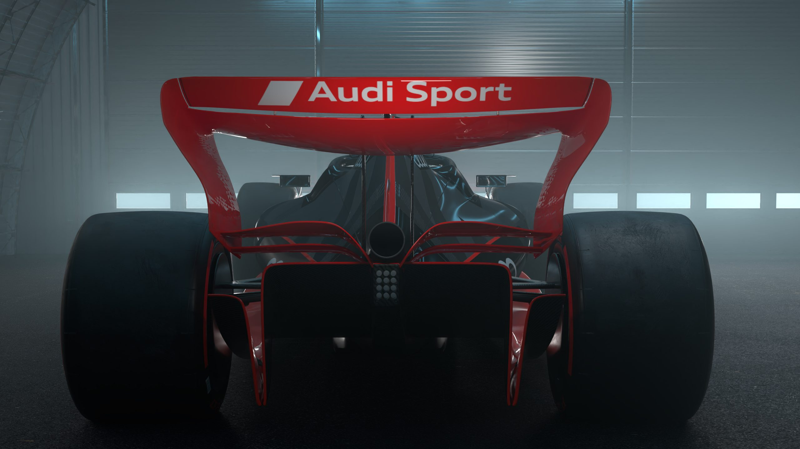

# GeoPic – Bilder- & Galerie-Workflow

**Zweck dieser Datei:** Anleitung, wie neue Bilder/Projekte zur Website hinzugefügt werden.
Robert kann diese Datei in einem neuen Thread hochladen und kurz sagen, was er geändert hat
(„Ich habe 3 Bilder in den Ordner `Heineken` gelegt" oder „Ich habe einen neuen Ordner `BMW` angelegt").
Die KI weiß dann anhand dieser Datei genau, was in der `index.html` zu tun ist.

---

## 1. Grundprinzip (wichtig!)

Die Website ist **statisch** (HTML, gehostet als GitHub Pages unter geopic.at).
Das heißt: **Der Browser kann den Inhalt eines Ordners NICHT automatisch auslesen.**
Es reicht *nicht*, Bilder in einen Ordner zu legen – **jedes Bild, das angezeigt werden soll,
muss in der `index.html` ausdrücklich eingetragen sein.**

Wenn Robert also neue Bilder hochlädt, ist die Aufgabe der KI immer:
→ die passenden Pfade in der `index.html` eintragen/ergänzen.

---

## 2. Ordnerstruktur & Namensregeln

Hauptordner: `C:\GeoPic-GitHub\geopic-website` (dort liegt die `index.html`).

- **Ein Ordner pro Werbesujet/Projekt.** Der Ordnername = Name des Hauptbilds (ohne `.jpg`).
  - Beispiel: Hauptbild `Porsche-Road.jpg` → Ordner `Porsche-Road/`
- **Im Projekt-Ordner liegen:**
  1. Das **Hauptbild** (= Thumbnail in der index.html), z. B. `Porsche-Road/Porsche-Road.jpg`
  2. Optional das **„Vorher"-Bild** für den Before/After-Vergleich – immer mit Endung `-AO`:
     z. B. `Porsche-Road/Porsche-Road-AO.jpg`
  3. Beliebig viele **Galerie-Bilder** (freie Namen): z. B. `Porsche-Road/Porsche.jpg`, `Porsche-Seite.jpg` …
- **Video-Thumbnails** liegen gesammelt in `video-thumbs/` (Filme öffnen einen Vimeo-Player, keine Galerie).
- Bewusst im Hauptordner geblieben: `Nespresso.jpg` (Block „In Produktion") und
  `Still-Nespresso-1080p.jpg` (Social-Vorschaubild). **Nicht verschieben.**

> **Achtung Groß-/Kleinschreibung:** Der Live-Server (GitHub Pages, Linux) unterscheidet
> Groß-/Kleinschreibung. `Audi-2.jpg` ≠ `audi-2.JPG`. Pfade müssen exakt zum Dateinamen passen.

---

## 3. Wie eine Sujet-Kachel aufgebaut ist

Die Kacheln stehen in der `index.html` im Abschnitt **„ARBEITEN"**, innerhalb von
`<div class="works-block sujets-block"> … <div class="sujets-grid"> … </div>`.

Es gibt vier Bild-Attribute (alle Pfade **mit Ordner**, relativ):

| Attribut       | Bedeutung |
|----------------|-----------|
| `img src=`     | Das Thumbnail in der Kachel = Hauptbild |
| `data-after`   | Das Hauptbild / „Nachher" (= dasselbe wie das Thumbnail) |
| `data-before`  | Das „Vorher"-Bild (`-AO`). **Nur** wenn es einen Before/After-Vergleich gibt |
| `data-gallery` | **Nur die ZUSÄTZLICHEN** Bilder, mit Komma getrennt. Optional |

### Galerie-Logik (so verhält sich der Klick)
- Beim Klick öffnet sich ein großes Fenster (Lightbox) mit Pfeilen, Tastatur, Wischen und Zähler („2 / 4").
- **Das Hauptbild erscheint automatisch als Erstes** – entweder als Before/After-Regler
  (wenn `data-before` + `data-after` vorhanden) oder als Einzelbild (nur `data-after`).
- Danach kommen die Bilder aus `data-gallery`, in der eingetragenen Reihenfolge.
- **→ In `data-gallery` NIE das Hauptbild wiederholen, nur die Extras eintragen.**

---

## 4. Vorlagen zum Kopieren

### A) Sujet MIT Before/After (+ optionaler Galerie)
```html
<div class="sujet-item has-slider"
     data-before="Porsche-Road/Porsche-Road-AO.jpg"
     data-after="Porsche-Road/Porsche-Road.jpg"
     data-gallery="Porsche-Road/Porsche.jpg, Porsche-Road/Porsche-Seite.jpg">
  <div class="sujet-thumb">
    
    <div class="sujet-badge">Werbesujet</div>
  </div>
  <div class="work-meta">
    <div class="work-title">Porsche – Road Visual</div>
    <div class="work-client">Porsche · Werbesujet</div>
  </div>
</div>
```

### B) Sujet OHNE Before/After (Einzelbild + optionaler Galerie)
```html
<div class="sujet-item lightbox-only"
     data-after="Audi-F1/Audi-F1.jpg"
     data-gallery="Audi-F1/Audi-2.jpg, Audi-F1/Audi-3.jpg, Audi-F1/Audi-4.jpg">
  <div class="sujet-thumb">
    
    <div class="sujet-badge">Werbesujet</div>
  </div>
  <div class="work-meta">
    <div class="work-title">Audi – F1</div>
    <div class="work-client">Audi · Werbesujet</div>
  </div>
</div>
```

Hinweise:
- `work-client` wird per CSS aktuell ausgeblendet, `work-title` erscheint am Desktop beim Hovern
  (am Handy gar nicht). Beide trotzdem im Code lassen – schadet nicht, hält die Struktur.
- `data-gallery` einfach weglassen, wenn es keine Zusatzbilder gibt.

---

## 5. Die zwei häufigsten Aufgaben

### Aufgabe A: „Ich habe neue Bilder in einen BESTEHENDEN Ordner gelegt"
1. Ordner per Datei-Liste (Glob) ansehen, um die **echten Dateinamen** zu erfahren.
2. Die passende Kachel in der `index.html` finden (nach Ordner-/Hauptbildnamen suchen).
3. Im `data-gallery` der Kachel die neuen Dateien ergänzen (mit Ordnerpfad, durch Komma getrennt).
   Falls noch kein `data-gallery` existiert: neu hinzufügen. **Hauptbild nicht eintragen.**
4. Reihenfolge im Attribut = Reihenfolge im Browser.

### Aufgabe B: „Ich habe einen NEUEN Ordner / ein neues Projekt angelegt"
1. Ordner ansehen (Glob), Dateinamen erfassen. Klären, welches das Hauptbild ist
   (i. d. R. das Bild, das so heißt wie der Ordner) und ob es ein `-AO`-Vorher-Bild gibt.
2. Eine neue Kachel aus Vorlage A oder B bauen (A wenn `-AO` vorhanden, sonst B).
3. Pfade, `work-title` und `work-client` (Format: „Marke · Werbesujet") setzen.
4. Die Kachel in `<div class="sujets-grid"> … </div>` einfügen –
   an der Position, an der sie erscheinen soll (Reihenfolge = Anzeigereihenfolge, Sujets vor Filmen).

---

## 6. Nach jeder Änderung
- Lokal: `index.html` neu laden, prüfen ob alle Bilder laden und die Galerie blättert.
- **Veröffentlichen auf geopic.at:** Änderungen müssen ins Git committed und gepusht werden
  (GitHub Pages). Erst dann sind sie live. (Robert erinnern, falls er das selbst macht.)

---

## 7. Checkliste für die KI (Kurzfassung)
- [ ] Welche Ordner haben sich geändert? Echte Dateinamen per Glob prüfen.
- [ ] Pfade immer **mit Ordner** und **exakt** (Groß/Klein!) schreiben.
- [ ] `data-gallery` = nur Zusatzbilder, Hauptbild NIE wiederholen.
- [ ] Neue Kachel? Vorlage A (mit `-AO`) oder B (ohne) verwenden, in `sujets-grid` einfügen.
- [ ] Nicht anfassen: `Nespresso.jpg`, `Still-Nespresso-1080p.jpg`, OG-Image-URLs.
- [ ] Robert ans Committen/Pushen erinnern.
